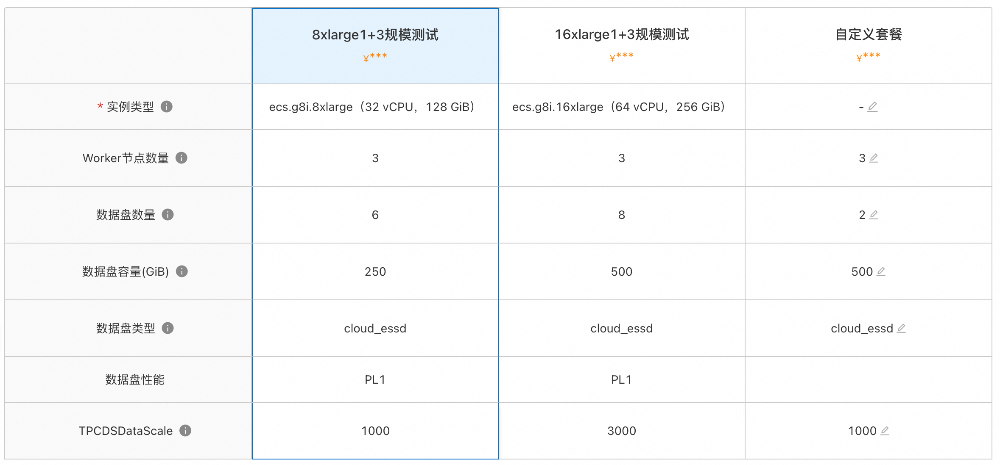
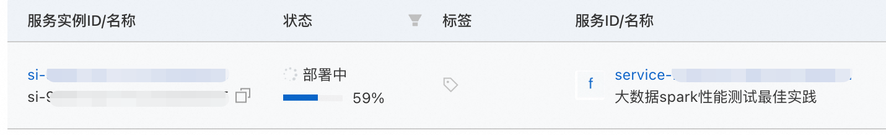
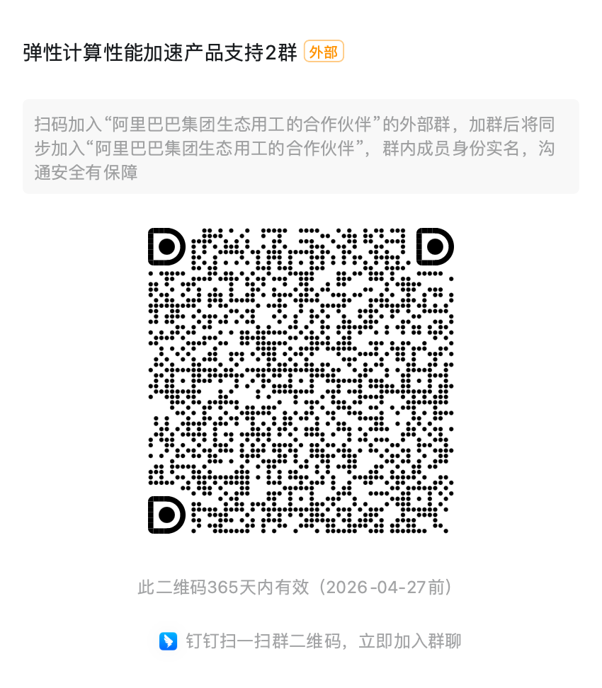

# 计算巢+ecs+fastmr实现spark-tpcds最佳实践

# 快速部署大数据spark环境并拉起测试

# 概述

本教程为您介绍如何使用FASTMR在阿里云上通过简单配置，自动拉起spark+hadoop大数据集群，实现集群互联和组件部署及监控，并完成TPCDS的数据生成和分析，简化云上大数据的部署流程，快速完成大数据业务选型PoC。

## 创建服务实例

### 第一步：选择配置

1.  服务实例名称（非必填，如无特殊要求，可以自定义或不填写使用默认值）；

2.  选择部署地域（可以自定义选择，如无特殊要求，保持默认即可）；

3.  资源配置：

     1.  选择付费时长（默认按量付费）；

     2.  这里阿里云也推荐了几款配置套餐，分别是8xlarge规格1master+3worker，以及16xlarge规格实例1master+3worker，可以按需选择，或者自定义套餐配置:

|  套餐名  |  说明  |
| --- | --- |
|  8xlarge 1+3规模测试  |  1master+3worker集群规模，默认测试1000G大小的TPCDS数据集规模。需要进一步选定实例类型，如g8i,g8a, g8y等  |
|  16xlarge 1+3规模测试  |  1master+3worker集群规模，默认测试3000G大小的TPCDS数据集规模。需要进一步选定实例类型，如g8i,g8a, g8y等  |
|  自定义套餐  |  可自由选择ECS实例，集群规模，和数据盘等配置  |

3.  配置可用区（如无特殊要求，保持默认即可）。

4.  配置ECS服务器密码（记住你的密码，后面要用）；

5.  网络配置：

6.  专有网络：可以选择新建或者已有专有网络，默认新建

7.  专有网络网段：根据需求选择（如无特殊要求，保持默认即可）。

8.  交换机子网网段：（如无特殊要求，保持默认即可）

9.  标签和资源组：

10.  标签：非必填，按需填写（如无特殊要求，保持默认即可）。

11.  资源组：非必填，按需填写（如无特殊要求，保持默认即可）。

### 第二步：确认订单

1.  在确认页面，勾选同意服务条款，点击“立即创建”，后面就是付款流程。

2.  当出现提交成功提示，说明服务已经开始创建，点击“去列表查看”，可以看到服务正在部署中。

3.  

4.  

### 第三步：进入实例详情

1.  服务部署包括大数据环境搭建和测试任务拉起，大约需要8分钟左右，点击服务实例ID进入服务详情。

2.  到这一步的时候，ECS实例上已经在部署数据spark+hadoop环境了，无需手动操作，非常方便。

3.  看到“立即使用”“yarnhistory address”以及“tpcds result”，这就是大数据环境的masterIP地址了，说明环境已经搭建完成，测试任务已经拉起，结果将被写到对应的oss目录。

*   当对应的oss目录出现tpcds\_result.csv文件时，说明tpcds测试已经完成，您下载可以查看结果。

     *   耗时时间跟集群规模以及测试数据规模相关，基于经验8xlarge 1+3 集群规模测试tpcds1000GB, 耗时约1.5h

至此，您已经成功搭建了大数据spark+hadoop环境，并进行了tpcds性能测试 。

## 登录master

前置条件：需要在master的ECS实例的安全组中，添加您的本地ip地址。

1.  远程连接ECS实例

*   通过密码认证登陆实例，参考[教程](https://help.aliyun.com/zh/ecs/user-guide/connect-to-a-linux-instance-by-using-a-password-1?spm=a2c4g.11186623.0.i5#undefined)

*   更多登陆方式见，ECS[连接实例](https://help.aliyun.com/zh/ecs/user-guide/connect-to-an-instance-overview/?spm=a2c4g.11186623.help-menu-25365.d_4_1_4.33436ef9otufAR&scm=20140722.H_48428._.OR_help-T_cn~zh-V_1)

## 删除服务实例

## 官方支持

您有任何问题或者建议，可以使用钉钉扫描下方二维码，加人我们的官方服务群，我们将非常欢迎您的建议和反馈～

